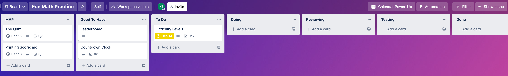
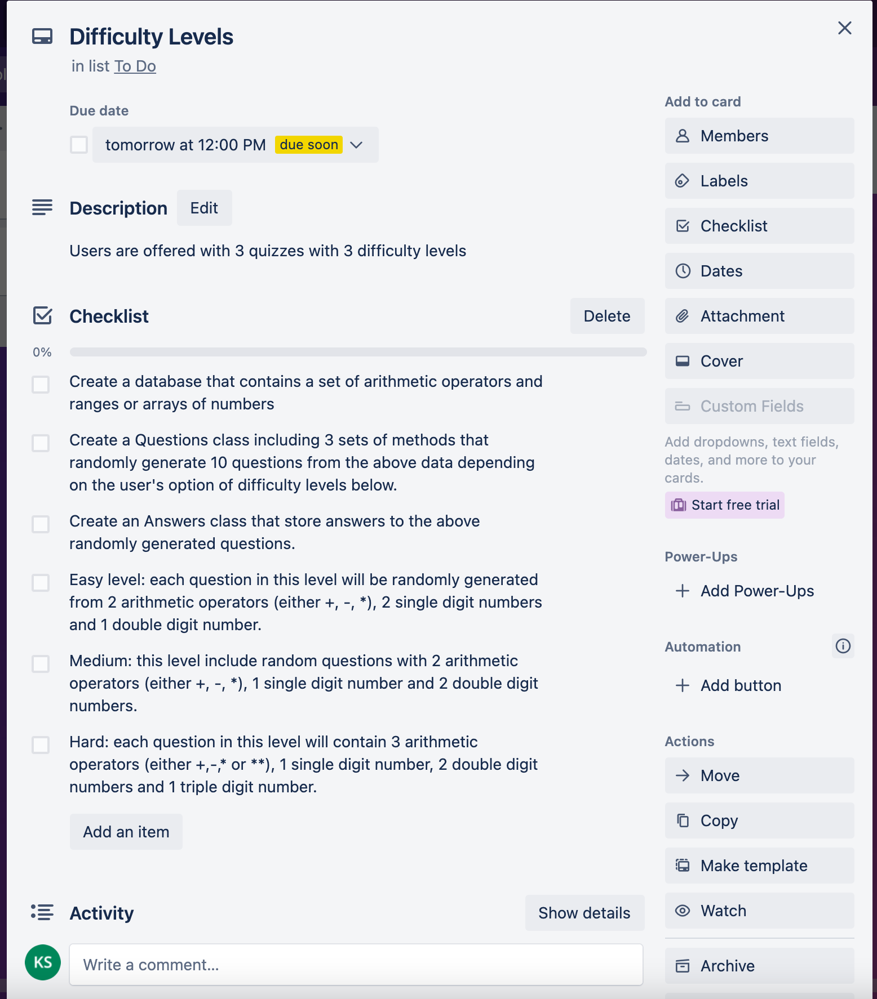
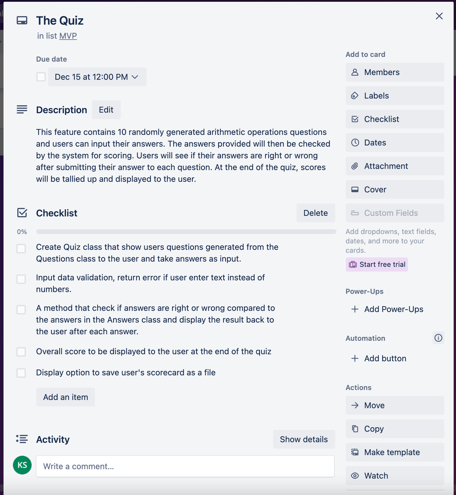
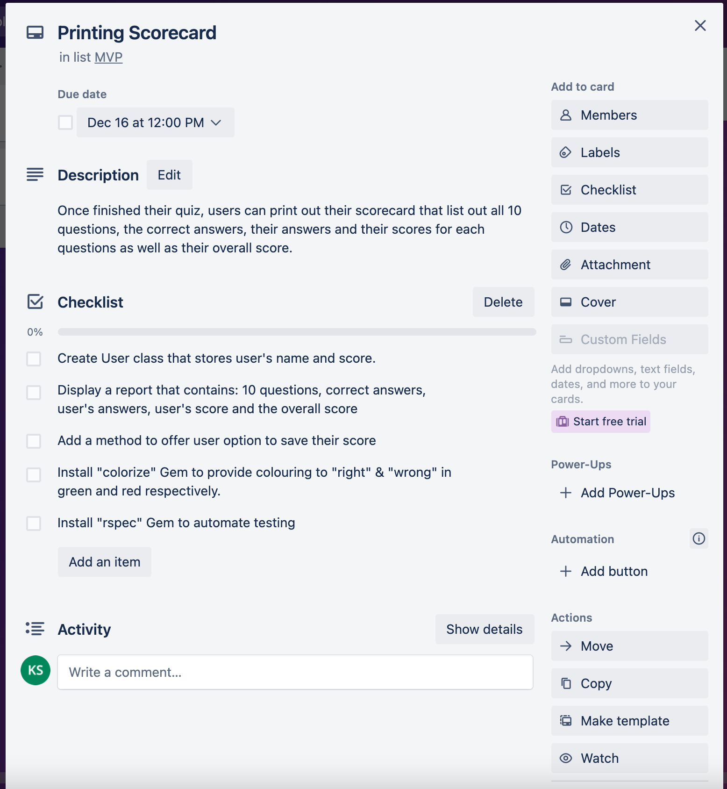

# Reference list
# GitHub Link
[GitHub Repo](https://github.com/kimbstocker/KimStocker_T1A3)
## Help Guide
This application require Ruby version 3.0.3 to run. To check if your computer have Ruby (or version of your Ruby), puts in your terminal
```
ruby --version
```
If you do not have Ruby 3.0.3 version, run the below line on your terminal to install the latest version of Ruby.
```
$ brew install ruby
``` 
Visit https://www.ruby-lang.org/en/documentation/installation/ for more info on how to install Ruby on your device.

To have the best experience with this App, please also install Ruby Gems 'colorize' and 'terminal-table'

You could run a script file below to automatically install all Gems and dependencies. 

Navigate to the route folder of the application, folder name "KimStocker_T1A3", in your terminal puts the below command to check the script

```
cat src/script/install-dependencies.sh
```
and to run the script put
```
sh src/script/install-dependencies.sh
```
Once everything is set up, you can use the below script to start the program
```
sh src/script/start-quiz.sh
```
Another way to start the program is to Navigate to 'KimStocker_T1A3/src' folder and run
```
ruby main.rb
```
For help menu, in 'KimStocker_T1A3/src' folder run
```
ruby main.rb -help
```
The programm requires you to enter your username and Quiz difficulty level (1,2 or 3) before you can start answering any questions. A shortcut to start the Quiz is to use the below script and command line arguments. 
Kindly change (username to your username, level to 1, 2 or 3 only)
```
sh src/script/start-quiz.sh username level
```
# Software Development Plan
## Purpose
In recent years, devices such as computers, phones, calculators etc. have done extremely well at taking over the role of processing and solving mathematical problems for humans. However, learning and understanding math is still evidently an important skill for our everyday life. Mathematics, particularly mental arithmetic operations calculations are also known to help increase the human’s brain capacity. Daily brain exercises such as learning a new language, playing Sudoku, playing Chess etc. are also proven to reduce the risk of having alzheimer's disease. This Math Quiz App is developed with the hope to help engaging kids as well as adults in practicing and challenging themselves at mental arithmetic operations (except division). And as a result, improving their intelligence and brain's capacity. 
## Scope
This application is designed for school age children as well as anyone who love Math and wants to practice solving arithmetic operations (except division) using their brain instead of a calculator. 
Users are invited to download and install the application package that include Ruby and Ruby gems installation.
There are 3 difficulty levels ranking from easy, medium to hard. Users will need to answer 10 questions and they will see their score for each question as well as their overall score at the end of the Quiz. Users can use the help guide to choose one of the level by entering it on the command line or follow the prompt if they run the app manually.

Once a user run the appliction and chose the difficulty level, they will:

- See the first question of the quiz. 
- The user will then need to enter their answer.
- Once answer is entered, the user will see if their answer is right or wrong as well as the next question of the quiz. 
- This process will be repeated for a total of 10 questions.
- After answering the 10th question, the user will see their score card. 
- If the user hit the perfect score 10/10, they will be praised with a message.
- If the user is on top of the leaderboard, they will also be notified with a message. All user scores are stored in the program even it the user exit the program and reentered. 
- They will also see option to save the score card if they finish all 10 questions ("yes" or "no" options). This option will not be displayed when the user quit in the middle of the quiz. 
- If the user choose to save the scorecard as a file, (they must enter "yes". If they enter anything other than "yes" or "no" or "q" to quit, an error message will pop up and ask them to enter either "yes", "no" or "q" only) a file will be created and saved in the "scorecards" folder and a message with the file location will be displayed to the user.
- The user will then see options to replay the game or to quit the program. 
- The program continue to run unless the user chose "q" to exit the program.
## Features
### Feature 1: The Quiz
This feature contains 10 randomly generated arithmetic operations questions and users can input their answers. The answers provided will then be checked by the system for scoring. Users will see if their answers are right(green) or wrong(red) after submitting their answer to each question. At the end of the quiz, scores will be tallied up and displayed to the user.
### Feature 2: Difficulty Levels
Users are offered with 3 quizzes with 3 difficulty levels
- Easy: each question in this level will be randomly generated from 2 arithmetic operators (either +, -, *), 2 single digit numbers and 1 double digit number. 
- Medium: this level include random questions with 2 arithmetic operators (either +, -, *), 1 single digit number and 2 double digit numbers.
- Hard: each question in this level will contain 3 arithmetic operators (either +,-,* or **), 1 single digit number, 2 double digit numbers and 1 triple digit number.
### Feature 3: Printing Scorecard
Once finished their quiz, users can print out their scorecard that list out all 10 questions, the correct answers, their answers and their scores for each questions as well as their overall score.
## Control Flow Diagram
- show the workflow/logic and/or integration of the features in your application for each feature.
- utilise a recognised format or set of conventions for a control flow diagram, such as UML.
## Software Developement Plan and Implementation
- outlines how each feature will be implemented and a checklist of tasks for each feature
  
  
  
  
- prioritise the implementation of different features, or checklist items within a feature
- provide a deadline, duration or other time indicator for each feature or checklist/checklist-item
-  Your checklists for each feature should have at least 5 items.
  

